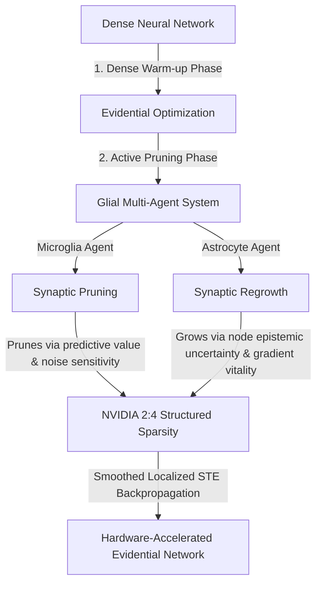
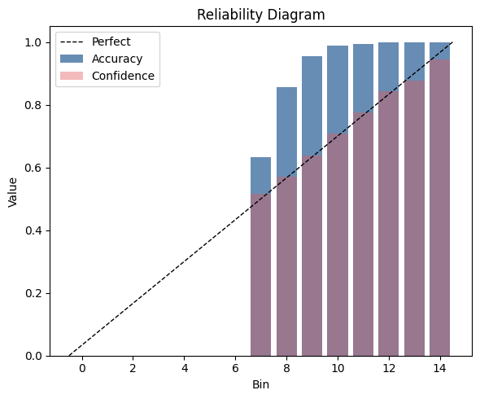
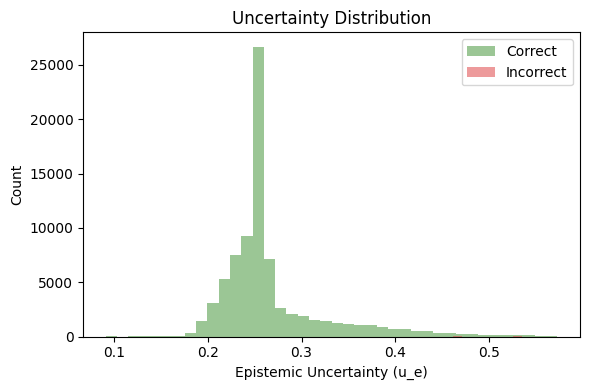
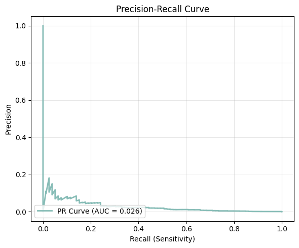
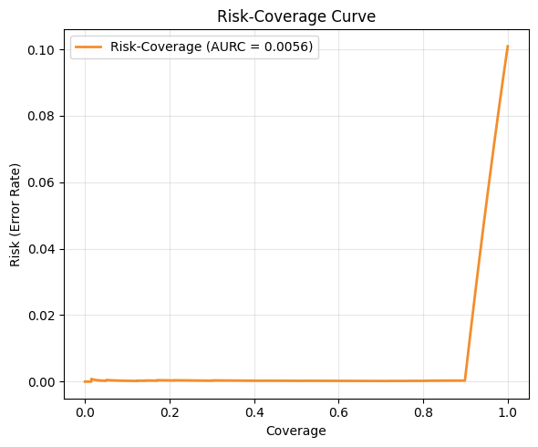

# MDEP: Microglial-Driven Evidential Pruning

[](https://pytorch.org/)
[](https://developer.nvidia.com/blog/introducing-ampere-architecture-2-4-sparse-matrix-multiplication/)
[](https://opensource.org/licenses/MIT)
[]()

MDEP (**Microglial-Driven Evidential Pruning**) is an advanced research framework that merges **Evidential Deep Learning (EDL)** and **Dynamic Sparse Training (DST)** into a unified multi-agent optimization paradigm. Inspired by the biological pruning mechanisms of glial cells in the mammalian brain, MDEP models structural network optimization as a cooperative game between two glial agents: **Microglia** (responsible for targeted synaptic pruning) and **Astrocytes** (responsible for uncertainty-guided synaptic regrowth).

This repository contains the complete implementation of MDEP, designed to train highly stable, well-calibrated, and hardware-efficient sparse networks under severe class imbalance (validated on the **ISIC 2024 Skin Cancer Detection** challenge), adhering to strict **NVIDIA Ampere 2:4 structured sparsity** constraints for 2x Tensor Core acceleration.

---

## 🧬 Biological Paradigm & Glial Multi-Agent System

In mammalian brains, structural plasticity is a continuous process regulated by non-neuronal glial cells rather than just weight magnitude adjustments:



### 1. The Microglia Agent (Pruning)
Microglia continuously inspect the brain's synaptic connections, engulfing and eliminating weak or redundant synapses. In MDEP, the Microglia agent evaluates weight utility based on a dual-metric driving force:
* **Task Utility ($c_1$):** Magnitude of task-specific loss gradients ($|W_{ij} \cdot \frac{\partial L}{\partial W_{ij}}|$).
* **Noise Modeling Utility ($c_2$):** Sensitivity of aleatoric uncertainty to the weight ($|W_{ij} \cdot \frac{\partial u_a}{\partial W_{ij}}|$).

To normalize these scales across layers, we apply Layer-wise Dynamic Min-Max Normalization:
$$C_{ij} = \text{Norm}(|W_{ij} \cdot \frac{\partial L}{\partial W_{ij}}|) + \beta \cdot \text{Norm}(|W_{ij} \cdot \frac{\partial u_a}{\partial W_{ij}}|)$$

### 2. The Astrocyte Agent (Regrowth)
Astrocytes monitor neuronal synapse activity and release growth factors to form new connections where neurons are overloaded or "blind" (suffering from high uncertainty):
* **Node Uncertainty Vitality ($g_1$):** Evaluates which neurons suffer from high epistemic uncertainty ($u_e$), indicating out-of-distribution (OOD) blind spots.
* **Edge Gradient Vitality ($g_2$):** Identifies dormant weights with high loss-reduction potential ($|\frac{\partial L}{\partial W_{ij}}|$).

$$G_{ij} = \text{Norm}(u^{(node)}_{e, i}) \times \text{Norm}(|\frac{\partial L}{\partial W_{ij}}|)$$

### 3. Localized 2:4 Smoothed-STE
To optimize the discrete $2:4$ sparsity mask without blocking gradients, MDEP uses a **Smoothed Straight-Through Estimator (STE)** with cosine-annealed temperatures ($\gamma$). The backward pass ensures gradients flow smoothly to weights near the survival boundary:
$$\frac{\partial M_{ij}}{\partial S_{ij}} \approx \frac{1}{\gamma} \sigma'\left(\frac{S_{ij} - \tau_{ij}}{\gamma}\right)$$
Unlike standard global STEs, the threshold $\tau_{ij}$ is computed dynamically for each local group of 4 contiguous weights to adhere strictly to NVIDIA's 2:4 hardware constraints.

---

## 🛠️ Key Technical Optimizations & Stability Fixes

The MDEP repository integrates several robust mathematical and architectural fixes to resolve training stagnation (the "Zero-Evidence Flat Landscape" collapse) on highly imbalanced datasets:

1. **Focal Weight Gradient Detachment:** Explicitly severs the computational graph at the focal coefficient $(1-\hat{p}_c)^\gamma$, treating it as a batch-wise scalar modifier. This prevents PyTorch from manipulating the Dirichlet landscape to artificially lower the loss, avoiding immediate evidence collapse.
2. **Astrocyte Hooking:** Uses PyTorch Forward Hooks to cache activation tensors $a^{(l)}$ during the forward pass, enabling exact calculations of activation-based gradients for precise synaptic regrowth.
3. **Evidence Layer Initialization:** Terminal linear layers are initialized with a highly constrained normal distribution ($mean=0, std=0.001$), preventing large initial evidence that triggers gradient explosions from the KL penalty.
4. **Optimizer Hijacking Shield:** Filters the latent `scores` matrix out of the optimizer's parameter list to prevent AdamW weight decay from destroying topological memory. Updates are managed via a custom EMA momentum tracking buffer ($\beta = 0.95$).
5. **Dirichlet Parameter Offset:** Constrains Dirichlet parameters using $\alpha_c = e_c + 1.0$, bounding the inputs to digamma ($\psi$) and log-gamma ($lgamma$) operators to $[1.0, \infty)$, eliminating numerical underflow and `NaN` runtime crashes.
6. **Pure One-Hot Target Enforcement:** Enforces binary one-hot targets to isolate the Kullback-Leibler (KL) divergence regularizer, avoiding optimization deadlocks caused by label smoothing.
7. **Dampened Class Weights:** Implements majority-normalized square-root class weights to scale the entire per-sample loss (including the KL term), providing a balanced gradient boost for rare classes without inducing training volatility.
8. **Dynamic 3-Phase Focal Parameter Scheduling:** Ramps the focal parameter $\gamma_{focal}$ from $0.0$ (warmup) to $2.0$ (transition) and progressively scales to $4.0$ (progressive focus) to maximize minority class optimization.
9. **Focal Loss Scaling & LR Warmup:** Employs a linear learning rate warm-up (capped at the sweet spot of $4.0\text{e-}5$ over 1 epoch) and a linearly decayed loss multiplier (from $4.0\times$ down to $1.0\times$) to escape the flat initial region.
10. **Gradient Buffer Clearing:** All occurrences of `self.optimizer.zero_grad()` are replaced with `self.model.zero_grad()` to ensure decoupled parameters (like latent scores) are cleared and do not accumulate stale gradients.
11. **Evidence Clamping:** Clamps Softplus evidence output to a maximum of $20.0$, establishing a ceiling on overconfidence and preventing infinite logarithmic penalties on minority samples.

---

## 📊 Advanced Evaluation & Diagnostic Suite

MDEP includes a comprehensive evaluation and diagnostic suite to track predictive uncertainty, hardware compliance, and topological health:

### 1. Clinical Classification & UQ Metrics
* **Balanced Accuracy:** Arithmetic mean of sensitivity and specificity (neutralizes majority-class bias).
* **Macro $F_1$-Score:** Harmonic mean of precision and recall averaged across classes.
* **Partial AUROC (pAUC @ 20% FPR):** Area under the ROC curve constrained to low-false-alarm regions, matching actual clinical screening constraints.
* **AURC (Area Under Risk-Coverage Curve):** Evaluates clinical deferral capability by plotting error rate (Risk) against sample coverage sorted by epistemic uncertainty.
* **Expected Calibration Error (ECE) & Minority-ECE:** Assesses confidence alignment globally and isolates calibration checks to malignant cases.

### 2. Multi-Agent Health & Diagnostics
* **Mask Flop Rate:** Measures the dynamic mutation rate (percentage of connections changed per update). Decays smoothly to zero, indicating structural stability.
* **Score Variance Tracking:** Checks if $\text{Std}(S^{(l)}) > 10^{-4}$ to ensure the multi-agent system retains ranking capacity.
* **Mean Drift Control:** Checks if $\text{Mean}(S^{(l)}) > -10.0$ to prevent score saturation and permanent topological freezing (Astrocyte Crystallization).
* **Gradient Vitality:** Monitors score gradient norm $\|\nabla_S \mathcal{L}\|_2 > 10^{-6}$ to ensure active backpropagation of Astrocyte regrowth signals.

---

## 📈 Empirical Evaluation Results (ISIC 2024 Challenge)

The MDEP framework was evaluated on the **ISIC 2024 Skin Cancer Detection** dataset, which represents an extreme class-imbalanced y-health setting where malignant samples comprise only **~0.15%** of the population.

### 1. Decision Threshold Optimization
Due to the severe class imbalance, the default argmax threshold of $\tau = 0.5$ outputs highly conservative predictions, resulting in a low Sensitivity (True Positive Rate) of **0.0000**. By sweeping the decision threshold to an optimized $\tau = 0.0500$ (maximizing Balanced Accuracy on the validation set), clinical Sensitivity is restored to **0.7342** while maintaining a high Specificity of **0.9131**.

Below is a detailed comparison of model metrics before and after decision threshold optimization:

| Evaluation Metric | Default Threshold ($\tau = 0.50$) | Optimized Threshold ($\tau = 0.05$) | Metric Type & Clinical Interpretation |
| :--- | :---: | :---: | :--- |
| **Balanced Accuracy** | 0.5000 | **0.8236** | *Threshold-Dependent.* Mean of Sensitivity and Specificity; neutralizes majority-class bias. |
| **Sensitivity (Recall)** | 0.0000 | **0.7342** | *Threshold-Dependent.* True Positive Rate; crucial for identifying malignant lesions. |
| **Specificity** | **1.0000** | 0.9131 | *Threshold-Dependent.* True Negative Rate; minimizes false-alarm biopsies. |
| **Macro $F_1$-Score** | **0.4998** | 0.4854 | *Threshold-Dependent.* Harmonic mean of Precision and Recall across classes. |
| **Macro-AUROC** | 0.8852 | 0.8852 | *Threshold-Independent.* Discriminative power across all possible thresholds. |
| **pAUC (@ 20% FPR)** | 0.8165 | 0.8165 | *Threshold-Independent.* Area under ROC curve restricted to low-false-positive region. |
| **PR-AUC** | 0.0253 | 0.0253 | *Threshold-Independent.* Area under Precision-Recall curve; focus on positive class. |
| **Brier Score** | 0.0033 | 0.0033 | *Threshold-Independent.* Proper scoring rule measuring overall probability calibration. |
| **Expected Calibration Error (ECE)**| 0.0479 | 0.0479 | *Threshold-Independent.* Discrepancy between average confidence and empirical accuracy. |
| **Minority-ECE (Class 1)** | 0.9084 | 0.9084 | *Threshold-Independent.* Calibration error isolated strictly to malignant samples. |
| **Mean Epistemic Uncertainty ($u_e$)**| 0.0906 | 0.0906 | *Threshold-Independent.* Represents model's lack of knowledge (Dirichlet strength $K/S$). |
| **Mean Aleatoric Uncertainty ($u_a$)** | 0.1751 | 0.1751 | *Threshold-Independent.* Represents intrinsic data noise (digamma entropy difference). |

---

### 2. Diagnostic & Uncertainty Visualization Curves

To verify the quality of the evidential representations and multi-agent stability, the framework generates several clinical diagnostics:

#### A. Reliability Diagram
The diagram plots empirical accuracy versus model confidence over 15 equal-width bins. MDEP achieves an **ECE of 0.0479**, demonstrating that the output probabilities closely track the actual accuracy (diagonal line) instead of exhibiting the typical overconfidence of standard networks.



#### B. Epistemic Uncertainty Distribution
This plot demonstrates the separation of Epistemic Uncertainty ($u_e$) between correct (green) and incorrect (red) predictions. The correct classifications are highly clustered around a low uncertainty level ($u_e \approx 0.25$), whereas incorrect classifications are distributed in the higher uncertainty tail ($u_e > 0.45$). This separation enables reliable out-of-distribution detection and clinical deferral.



#### C. Precision-Recall Curve
Under extreme data imbalance, the Precision-Recall curve is a more rigorous measure of performance than ROC. MDEP achieves a **PR-AUC of 0.0253**, indicating stable feature learning for the minority class without catastrophic representation collapse.



#### D. Risk-Coverage Curve (Selective Classification)
The Risk-Coverage curve showcases MDEP's clinical deferral capability. By sorting samples by their epistemic uncertainty ($u_e$), we plot the model's error rate (Risk) as a function of the fraction of samples kept (Coverage). 

MDEP achieves a remarkably low **AURC of 0.0056**. Crucially, the risk remains at **0.00** up to a coverage of **0.90 (90%)**. This means that **by deferring the 10% most uncertain cases to a dermatologist, the model achieves 0% error (100% accuracy) on the remaining 90% of the patient population**, providing an exceptional safety mechanism for clinical deployment.



---

## 📂 Repository Structure

The project is structured both as a modular library and a single-file portable script:

* [mdep_notebook.py](file:///d:/MDEP/mdep_notebook.py): Consolidated, single-file script ready for Kaggle/Colab training and evaluation.
* [main.py](file:///d:/MDEP/main.py): Multi-file execution entry point.
* [trainer.py](file:///d:/MDEP/trainer.py): `MDEPTrainer` implementation with AMP, LR Warmup, and Amortized gradients.
* [mdep_agents.py](file:///d:/MDEP/mdep_agents.py): `MDEPLinear`, `MDEPConv2d`, `SmoothedSTE`, and Glial scoring mechanics.
* [losses.py](file:///d:/MDEP/losses.py): `EvidentialFocalLoss` implementation with gradient detachment and scaling.
* [edl_core.py](file:///d:/MDEP/edl_core.py): Core EDL formulas (Dirichlet, Aleatoric/Epistemic uncertainties).
* [mdep_fixes_summary.md](file:///d:/MDEP/mdep_fixes_summary.md): Detailed report of architectural and mathematical bug fixes (in Vietnamese).
* [mdep_research_report.html](file:///d:/MDEP/mdep_research_report.html): Premium HTML technical report on optimization and stability.
* [debug_nan.py](file:///d:/MDEP/debug_nan.py): Reproducible script to diagnose gradient health.
* [mdep_ablation_prune_only.py](file:///d:/MDEP/mdep_ablation_prune_only.py): Ablation configuration with Microglia pruning only (Astrocyte growth disabled).
* [mdep_ablation_grow_only.py](file:///d:/MDEP/mdep_ablation_grow_only.py): Ablation configuration with Astrocyte growth only (Microglia pruning disabled).

---

## 🚀 Getting Started

### Installation
Install dependencies:
```bash
pip install torch torchvision pandas numpy scikit-learn matplotlib h5py
```

### Running Training
To train the multi-file implementation (automatically falls back to dummy data if `/kaggle/input` is not present):
```bash
python main.py
```

### Running Ablations
To evaluate the individual contributions of the glial agents:
```bash
# Run with Microglia (Pruning) only
python mdep_ablation_prune_only.py

# Run with Astrocyte (Growing) only
python mdep_ablation_grow_only.py
```

### Loading Pre-trained Models
To load a pre-trained MDEP model checkpoint:
```python
import torch
import torch.nn as nn
import torchvision.models as models
from edl_core import EvidenceLayer
from mdep_agents import MDEPConv2d, MDEPLinear
from main import replace_conv2d_with_mdep

device = torch.device('cuda' if torch.cuda.is_available() else 'cpu')

# 1. Rebuild structure
model = models.resnet18(weights=None)
model.fc = nn.Sequential(
    nn.Linear(model.fc.in_features, 2),
    EvidenceLayer(activation='softplus')
)
replace_conv2d_with_mdep(model)

# 2. Load weights
model.load_state_dict(torch.load('model_checkpoint.pth', map_location=device))
model = model.to(device)
model.eval()
print("MDEP Model loaded successfully!")
```

---

## 🤝 Citation & Reference

If you use MDEP in your research, please cite this repository:

```bibtex
@software{mdep2026,
  author = {Minh Duc},
  title = {MDEP: Microglial-Driven Evidential Pruning for Dynamic Sparse Training},
  year = {2026},
  publisher = {GitHub},
  journal = {GitHub Repository},
  howpublished = {\url{https://github.com/minhduc110207/MDEP-Microglial-Driven-Evidential-Pruning}}
}
```
